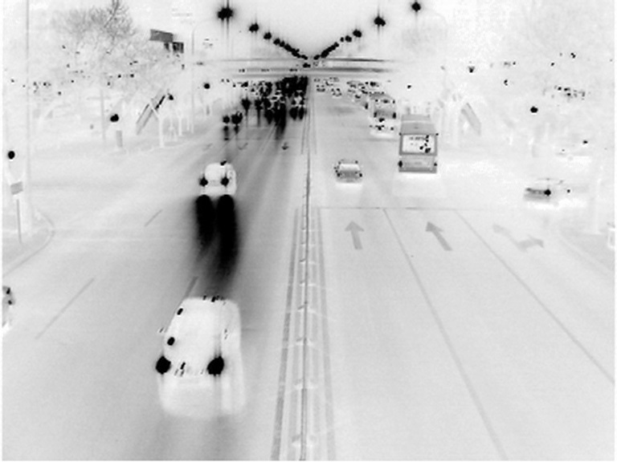

# 使用C++读取8位BMP位图  #

## 一、 基础知识 ##
  
1. 微软的图像库关于位图的数据结构[BITMAPFILEHEADER](https://msdn.microsoft.com/zh-cn/subscriptions/downloads/aa452883.aspx)、[BITMAPINFOHEADER](https://msdn.microsoft.com/en-us/library/windows/desktop/dd183376(v=vs.85).aspx)
2. 位图存储时候的[四字节对齐](http://www.360doc.com/content/13/0427/21/11962419_281393082.shtml)。
3. [调色板](http://blog.csdn.net/qsycn/article/details/7801145)的理解

##二、八位图片的读取 ##
  
细节见代码和注释。需要注意的是我们实际读的时候忽略了填充的字节（没必要）。

	BYTE *RmwRead8BitBmpFile2Img(const char * filename,int *width,int *height)
	{   
		FILE *BinFile;
		BITMAPFILEHEADER FileHeader;
		BITMAPINFOHEADER BmpHeader;
		BYTE *pImg;
		unsigned int size,ex=0;
		int Suc=1,h,linenum; //linenum是考虑字节对齐后的一行像素实际占的字节数
		
	
		// Open File
		*width=*height=0;
		if((BinFile=fopen(filename,"rb"))==NULL) return NULL; //二进制读取，否则会被编码方式折腾
		// 读头部结构信息
		if (fread((void *)&FileHeader,1,sizeof(FileHeader),BinFile)!=sizeof(FileHeader)) Suc=-1;
		if (fread((void *)&BmpHeader,1,sizeof(BmpHeader),BinFile)!=sizeof(BmpHeader)) Suc=-1;
		//读取头部信息失败
	    if ( (Suc==-1) || 
			 (FileHeader.bfOffBits<sizeof(FileHeader)+sizeof(BmpHeader) )
		   ) 
		{ 
			fclose(BinFile); 
			return NULL; 
		}
	
		// Read Image Data
		*width=BmpHeader.biWidth;
		//计算包括4字节填充后的实际长度 
		linenum=(BmpHeader.biWidth+3)/4*4; 
		ex=linenum-*width;
		*height=h=BmpHeader.biHeight;
		size=*height*linenum;
		//文件指针指向读取像素数据的地方
		fseek(BinFile,FileHeader.bfOffBits,SEEK_SET); 
		if ( (pImg=new BYTE[size])!=NULL)
		{
			//按照左右，上下的顺序读 
			for(int i=0;i<h;i++)  
			{
				//这里的处理只读了真实数据部分
				if (fread(pImg+(h-1-i)*(*width),sizeof(BYTE),*width,BinFile)!=*width) 
				{ 
					fclose(BinFile);
					delete pImg;
					pImg=NULL;
					return NULL;
				}
				//忽略填充字节
				fseek(BinFile,ex,SEEK_CUR); 
			}
		}
		fclose(BinFile);
		return pImg;
	}

##三、八位图片的存储 ##

下面给出的代码用调色板把原图Fig.1变成Fig.2的样子。这么做是为了强调调色板的作用。如果需要正常的存8位图稍微修改调色板那一部分就行了。

	bool RmwWriteByteImg2BmpFile(BYTE *pImg,int width,int height,const char * filename)
	{   FILE * BinFile;
	    BITMAPFILEHEADER FileHeader;
	    BITMAPINFOHEADER BmpHeader;
	    int i,extend;
		bool Suc=true;
		BYTE p[4],*pCur;
		BYTE* ex;
	
	    // Open File
	    if((BinFile=fopen(filename,"w+b"))==NULL) {  return false; }
		//参数填法见结构链接
		FileHeader.bfType= ((WORD) ('M' << 8) | 'B');
		FileHeader.bfOffBits=sizeof(BITMAPFILEHEADER)+sizeof(BITMAPINFOHEADER)+256*4L;//2个头结构后加调色板
	    FileHeader.bfSize=FileHeader.bfOffBits+width*height ;
	    FileHeader.bfReserved1=0;
	    FileHeader.bfReserved2=0;
		if (fwrite((void *)&FileHeader,1,sizeof(FileHeader),BinFile)!=sizeof(FileHeader)) Suc=false;
		// Fill the ImgHeader
		BmpHeader.biSize = 40;
	    BmpHeader.biWidth = width;
		BmpHeader.biHeight = height;
		BmpHeader.biPlanes = 1 ;
		BmpHeader.biBitCount = 8 ;
		BmpHeader.biCompression = 0 ;
		BmpHeader.biSizeImage = 0 ;
		BmpHeader.biXPelsPerMeter = 0;
		BmpHeader.biYPelsPerMeter = 0;
		BmpHeader.biClrUsed = 0;
		BmpHeader.biClrImportant = 0;
		if (fwrite((void *)&BmpHeader,1,sizeof(BmpHeader),BinFile)!=sizeof(BmpHeader)) Suc=false;
	    // 写入调色板
	    for (i=0,p[3]=0;i<256;i++) 
	    {  
		   p[3]=0;
		   p[0]=p[1]=p[2]=255-i; // blue,green,red;
	       if (fwrite((void *)p,1,4,BinFile)!=4) { Suc=false; break; }
		}
	    // write image data
		extend=(width+3)/4*4-width;
	
		if(extend)
		{
			ex=new BYTE[extend]; //填充数组大小为 0~3
			memset(ex,0,extend);
		}
	
		for(pCur=pImg+(height-1)*width;pCur>=pImg;pCur-=width)
		{   
			if (fwrite((void *)pCur,1,width,BinFile)!=(unsigned int)width) Suc=false; // 真实的数据
			if(extend) // 扩充的数据 这里填充0
			    if (fwrite((void *)ex,1,extend,BinFile)!=1) Suc=false;
		}
	
		// return;
		fclose(BinFile);
		if(extend)
			delete[] ex;
		return Suc;
	}

##四、主调函数和结果 ##

 主调函数：

	#include<windows.h>
	#include<stdio.h>
	int main()
	{
		int width,height,rwidth;
		BYTE *pFile;
		pFile=RmwRead8BitBmpFile2Img("D:\\test.bmp",&width,&height);
		RmwWriteByteImg2BmpFile(pFile,width,height,"D:\\test1.bmp");
	}

 
**Fig.1**
 

 
**Fig.2**
 
 
 

##五、说明 ##
本代码是在BOSS给的课件代码基础上改的。原来代码对字节填充的处理方式会人为给图片带来黑边，处理方式是不合适的。24位BMP图的读存和8位类似。可以自行编写。 
需要注意的地方是**字节对齐**而不是**宽度对齐**图像一个像素宽度在位深不同的情况下是不一样的。在8位图处理的时候宽度被4整除和字节被4整除等价（一个像素宽度对于一个字节），但是在24位的时候一个像素宽度由3个字节表示。所以这个时候不能以宽度为基准了。比如此时宽度为2，正确填充方式是一行有2\*3=6个字节，再填充2个字节能被4整除。如果以宽度为基准，像素宽度扩为4，则填充了4\*3-2\*3=6个字节。可见结果是不同的。前一种是正确的处理方式。

   
 
